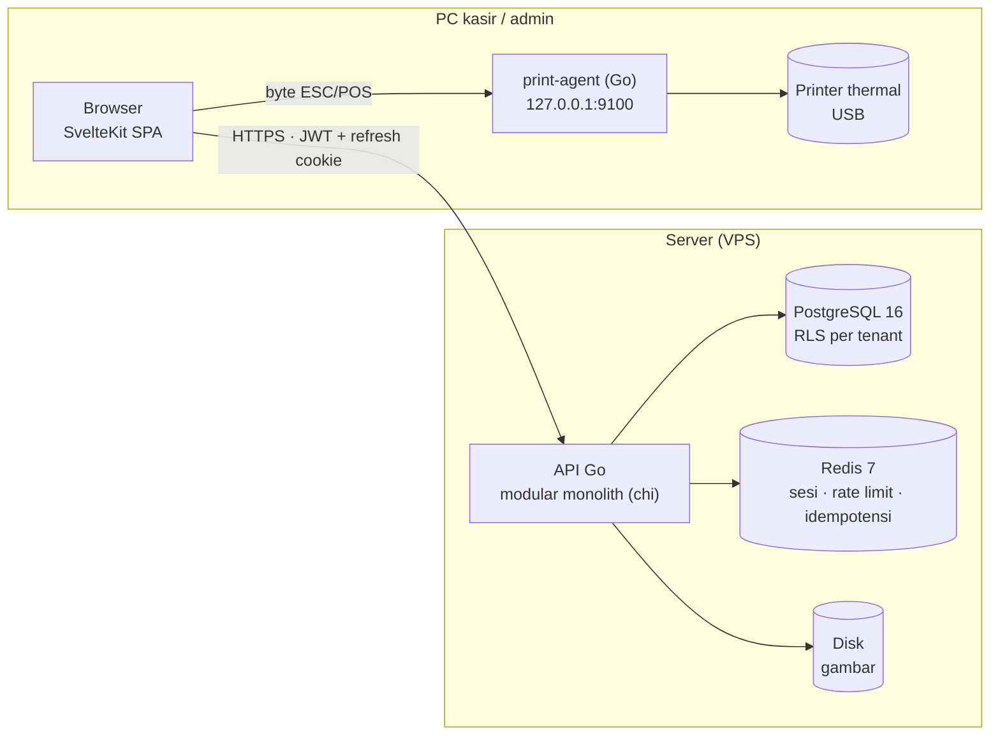

<div align="center">


# ARUS — POS & ERP Ritel

**Kasir dan back-office untuk toko ritel multi-cabang: cepat di kasir, rapi di stok, jujur di angka.**


[Fitur](#-fitur) · [Arsitektur](#-arsitektur) · [Mulai cepat](#-mulai-cepat) · [Status](#-status--roadmap) · [Deploy](#-deploy) · [Dokumentasi](#-dokumentasi)

</div>

---

> [!NOTE]
> **ARUS sedang dikembangkan aktif.** Target pertama: go-live **pilot di satu toko ritel** (rencana mulai **1 November 2026**). Fitur kasir web sudah praktis lengkap, dan aplikasi **Android (Flutter)** mulai dibangun. Yang tersisa ada di luar layar kasir, yaitu import katalog, backup teruji, spec test, dan CI. Lihat [Status & Roadmap](#-status--roadmap).

## Apa itu ARUS?

ARUS adalah aplikasi web **Point of Sale + ERP ringan** untuk usaha ritel yang punya satu atau banyak cabang. Satu instalasi melayani banyak bisnis (*multi-tenant*). Data tiap bisnis terisolasi di server dan juga di database.

ARUS dibangun ulang dari nol untuk menggantikan sistem lama (CodeIgniter 4 + Node.js + MySQL). Sistem lama hanya dipakai sebagai referensi aturan bisnis. **Tidak ada migrasi data**: toko mulai lewat *onboarding* (import barang, saldo awal stok, saldo awal piutang/hutang).

| Masalah di sistem lama | Jawaban ARUS |
|---|---|
| API tanpa autentikasi, tenant diambil dari isian browser | Tenant, outlet, dan user selalu dari token di server, ditambah **Row Level Security** PostgreSQL |
| Transaksi tidak atomik, stok balapan antar kasir | Satu use-case = satu transaksi DB; stok berupa **ledger** dengan penjaga atomik |
| Uang disimpan sebagai `DOUBLE` | `NUMERIC(18,2)` untuk uang, `NUMERIC(18,3)` untuk qty; di Go tanpa float |
| Harga dikirim browser dan disimpan apa adanya | **Harga dihitung server**; ubah harga wajib PIN penyetuju dan tercatat di audit |
| Aturan bisnis tersembunyi di trigger/SP, termasuk bug poin saat edit nota | Aturan ada di service Go yang dites; nota tidak pernah ditimpa (edit = revisi) |
| Kiriman ganda membuat nota ganda | **Idempotency-Key** di setiap endpoint pembuat transaksi |

## ✨ Fitur

<table>
<tr><td valign="top" width="50%">

**🧾 Kasir (POS)**
- Layar keyboard-first, dengan shortcut F1–F10 dan bantuan F1
- Dua tampilan: **modern** (`/kasir`) dan **klasik** gaya desktop (`/kasirb`), pilihan diingat
- Scan barcode, kolom QTY, 16 slot pintasan barang, nota pending
- Pencarian cepat untuk katalog **>100 ribu barang**
- Bayar tunai, non-tunai, split, **kredit + DP** (limit per member)
- Member, poin, kupon, salesman, biaya lain dinamis
- Peringatan dini stok kurang dan harga di bawah HPP
- **Shift kasir**: modal awal, hitung fisik per metode, selisih wajib catatan + PIN
- **Cetak struk** 58/80 mm lewat browser atau *print-agent* ESC/POS, struk tutup shift, rekap harian
- Edit/batal nota lewat **revisi**, retur penjualan

</td><td valign="top">

**📦 Stok**
- Ledger append-only dengan 3 bucket: Display, Gudang, Retur
- Aman untuk banyak kasir yang menjual barang sama secara bersamaan
- Saldo awal + kunci tanggal mulai operasional
- **Opname** (sesi atau langsung), **pecah satuan**
- **Mutasi** antar cabang/bucket (kirim → terima, selisih tercatat)
- Kartu stok dengan saldo berjalan

</td></tr>
<tr><td valign="top">

**🛒 Pembelian & hutang**
- Pembelian tunai/kredit, diskon baris bertingkat, biaya lain nota
- **HPP rata-rata tertimbang per cabang**
- Edit/batal dengan revisi, retur beli dari bucket Retur
- Hutang pemasok: cicilan, pelunasan kolektif, aging
- Kredit pemasok, riwayat harga beli

</td><td valign="top">

**👥 Pelanggan & keuangan**
- Member dengan **level berdasarkan poin**, ledger poin
- **Deposit member** sebagai metode bayar
- Piutang: cicilan, pelunasan kolektif, aging, saldo awal
- Metode bayar per tenant dengan **biaya MDR** (ditanggung toko atau pelanggan)
- Daftar penjualan semua kasir, HPP & laba (khusus pemegang izin)
- **Dasbor** "toko baik-baik saja?": KPI, tren, terlaris, per jam, shift, stok menipis, perbandingan cabang dan bulan lalu
- **Penjualan Langsung** hari ini secara real-time (SSE)

</td></tr>
<tr><td valign="top">

**🗂️ Master data**
- Item: kode, barcode (boleh kembar antar barang), harga **per cabang**
- Harga **grosir bertingkat**, konversi satuan, gambar, deskripsi markdown
- Satuan, kategori, brand, principal, pemasok, salesman
- Riwayat harga jual

</td><td valign="top">

**🔐 Akses & keamanan**
- Register tenant, login argon2id, refresh token berotasi, kunci login bertahap
- Lupa/reset password, verifikasi email
- Role & izin per menu (view/create/update/delete/approve), anti-eskalasi
- Akses per outlet, cabut semua sesi, **audit log append-only**
- **Platform Admin** terpisah (wajib 2FA TOTP) dengan "masuk sebagai" yang diaudit

</td></tr>
</table>

**📱 ARUS Mobile (Flutter, Android, dalam pengerjaan):** login, tema terang/gelap, pilih bahasa dan cabang, serta layar kasir (cari barang, keranjang dengan harga dari server, bayar tunai/split, buka shift). Belum: member, kupon, kredit, nota pending, scan kamera, struk Bluetooth. Lihat [`source/mobile/README.md`](source/mobile/README.md).

Antarmuka web memakai tema Dreams Core (Tailwind v4), tersedia dalam **Bahasa Indonesia & Inggris**, tema terang/gelap, dan tab halaman yang menyimpan draf form.

## 🏗️ Arsitektur



| Lapisan | Teknologi |
|---|---|
| Backend | Go, `chi`, `pgx/v5`, `sqlc`, `goose`, `slog`, argon2id |
| Database | PostgreSQL 16+ — RLS, FK komposit, UNIQUE; tanpa stored procedure bisnis |
| Cache | Redis 7 — **tidak pernah** menjadi sumber kebenaran stok atau uang |
| Frontend | SvelteKit 3 (SPA, `adapter-static`), Tailwind v4, bits-ui, TanStack Query, zod |
| Mobile | Flutter (Android), Riverpod, go_router, dio; auth native lewat header `X-Client: mobile` |
| Cetak | print-agent Go tanpa dependensi (Windows spooler RAW / berkas perangkat); mobile: Bluetooth (direncanakan) |
| Deploy | Docker Compose (Postgres + Redis), binary Go via systemd, web statis di Apache/Nginx |

**Invarian yang dijaga di semua modul:** tenant/outlet dari token · satu use-case satu transaksi · harga dihitung server · stok = ledger · idempotensi · kunci bisnis dijaga DB · uang tanpa float · aturan bisnis di service Go yang dites · tanpa secret di repo. Uraian lengkapnya ada di [`AGENTS.md` §3](AGENTS.md); desain data dan struktur modul di [`docs/ARCHITECTURE.md`](docs/ARCHITECTURE.md).

## 🚀 Mulai cepat

**Prasyarat:** Go 1.27+, Node.js 26 (npm 11), Docker + Compose, [`goose`](https://github.com/pressly/goose) (`go install github.com/pressly/goose/v3/cmd/goose@latest`). `sqlc` hanya diperlukan bila mengubah `queries.sql`. Aplikasi mobile tambahan butuh Flutter 3.47 + JDK 17 + Android SDK (lihat [`docs/DEV-ENV.md`](docs/DEV-ENV.md)).

Jalankan dari root repo (folder `arus`):

```bash
git clone https://github.com/erayadigitalsolusindo/arus.git && cd arus

# 1. PostgreSQL (127.0.0.1:5433) + Redis (127.0.0.1:6380)
cp source/deploy/.env.example source/deploy/.env
docker compose -f source/deploy/docker-compose.yml --env-file source/deploy/.env up -d

# 2. Konfigurasi API: samakan password dengan deploy/.env, isi JWT_SECRET (≥ 32 karakter)
cp source/backend/.env.example source/backend/.env

# 3. Migration (pakai URL pemilik skema dari backend/.env)
export MIGRATE_DATABASE_URL='postgres://...'
goose -dir source/backend/db/migrations postgres "$MIGRATE_DATABASE_URL" up

# 4. API → http://localhost:8080/healthz
go -C source/backend run ./cmd/api

# 5. Web → http://localhost:5173 (terminal lain)
cd source/web && cp .env.example .env && npm ci && npm run dev
```

Buka <http://localhost:5173> → **Register** untuk membuat tenant dan akun Owner pertama. Di mode development email tidak dikirim. Isinya, termasuk tautan verifikasi/reset, hanya dicatat di log API.

<details>
<summary><b>Detail: dua koneksi database, Platform Admin, catatan instalasi</b></summary>

- **Dua URL database disengaja.** `MIGRATE_DATABASE_URL` adalah pemilik skema (khusus goose; melewati RLS). `DATABASE_URL` adalah role `aciraba_app` yang dipakai API: bukan pemilik dan tanpa BYPASSRLS, sehingga RLS selalu berlaku. Role ini dibuat otomatis oleh `source/deploy/initdb/01-app-role.sh` saat volume Postgres pertama kali dibuat.
- **Jangan `source` file `.env` secara utuh**, karena nilai berspasi (mis. `SMTP_FROM`) akan rusak. Cukup `export` variabel yang dibutuhkan.
- **npm 10 menolak lock file**; pakai npm 11 (`npx -y npm@11 ci`).
- **Platform Admin (opsional):** isi `PLATFORM_SETUP_TOKEN` (≥ 32 karakter) di `backend/.env`, restart API, lalu buka `/platform/setup` untuk membuat admin pertama (wajib daftar 2FA). **Hapus token itu setelah selesai.**
- Folder `docker/` di root adalah compose mesin dev pengembang (`eds_postgres`/`eds_redis`), **bukan** compose ARUS. Pakai `source/deploy/docker-compose.yml`.

</details>

<details>
<summary><b>Konfigurasi environment (<code>source/backend/.env</code>)</b></summary>

| Variabel | Keterangan |
|---|---|
| `APP_ENV` | `development` / `production` |
| `HTTP_ADDR` | alamat listen API, mis. `:8080` (harus cocok dengan `VITE_API_URL` di web) |
| `DATABASE_URL` | koneksi runtime (role `aciraba_app`) |
| `MIGRATE_DATABASE_URL` | koneksi pemilik skema, khusus goose |
| `REDIS_URL` | koneksi Redis |
| `JWT_SECRET` | wajib, ≥ 32 karakter. **Menggantinya membuat semua PIN penyetuju dan rahasia 2FA tidak berlaku** |
| `CORS_ORIGINS` | origin SPA yang diizinkan (juga dipakai penjaga CSRF) |
| `APP_BASE_URL` | alamat SPA untuk tautan email; wajib `https://` di luar dev |
| `SMTP_HOST/PORT/USER/PASS/FROM` | email; kosong di dev = hanya log; **wajib di produksi** |
| `UPLOAD_DIR` | folder gambar (bawaan `./data/uploads`; di produksi: volume yang dicadangkan) |
| `TRUST_PROXY` | `true` hanya di belakang reverse proxy tepercaya (mengaktifkan `X-Forwarded-For`) |
| `PLATFORM_SETUP_TOKEN` | membuat Platform Admin pertama; hapus setelah dipakai |

Frontend (`source/web/.env`): `VITE_API_URL` = alamat API.

</details>

<details>
<summary><b>Menjalankan test</b></summary>

```bash
# Backend — test integrasi di-skip bila tiga variabel ini kosong
export TEST_DATABASE_URL=...        # = DATABASE_URL (aciraba_app)
export TEST_ADMIN_DATABASE_URL=...  # = MIGRATE_DATABASE_URL (pemilik)
export TEST_REDIS_URL=...           # = REDIS_URL
(cd source/backend && go vet ./... && go test ./...)

# Frontend
(cd source/web && npm run check && npm run build)

# Print-agent
(cd source/print-agent && go test ./...)

# Mobile (tanpa server, memakai fake HTTP)
(cd source/mobile && flutter analyze && flutter test)
```

Test membuat dan membersihkan tenant uji sendiri; pakai database dev, bukan produksi. Banyak test bersifat **konkuren** (mis. 25 kasir menjual stok 10 → tepat 10 berhasil), jadi jangan dilewati. CI belum ada, jadi jalankan semuanya sebelum push.

</details>

<details>
<summary><b>Troubleshooting</b></summary>

| Gejala | Penyebab umum |
|---|---|
| API menolak start | `JWT_SECRET` < 32 karakter, atau `SMTP_HOST` kosong di mode production |
| `/healthz` → `redis: down` | password Redis di `backend/.env` berbeda dengan `deploy/.env` |
| UI "Server unreachable" | API mati / `VITE_API_URL` ≠ `HTTP_ADDR` / origin belum ada di `CORS_ORIGINS` |
| Rute/kolom baru tidak ada setelah `git pull` | migration belum diterapkan atau proses API lama belum di-restart |
| Test integrasi ter-skip | `TEST_DATABASE_URL`, `TEST_ADMIN_DATABASE_URL`, `TEST_REDIS_URL` belum diatur |
| `npm ci`: "lock file out of sync" | npm terlalu lama; pakai npm 11 |
| Kasir tak bisa simpan nota (`SHIFT_REQUIRED`) | kasir belum membuka shift |
| Struk tak tercetak lewat agent | agent belum berjalan atau origin web belum terdaftar; lihat [`PC-KASIR.md`](source/deploy/PC-KASIR.md) |
| Login berputar di produksi | Cloudflare SSL *Flexible* (harus *Full strict*), atau web & API beda domain induk |
| PIN/2FA tiba-tiba tak valid | `JWT_SECRET` diganti; atur ulang PIN dan minta admin lain me-reset 2FA |

</details>

## 📁 Struktur repo

```
.
├── AGENTS.md              # pintu masuk agen: keputusan terkunci, invarian, peta dokumen
├── CLAUDE.md              # pointer ke AGENTS.md
├── .agent/SESSION.md      # status sesi terkini dan langkah berikutnya
├── docs/                  # PRD, ROADMAP, ARCHITECTURE, DEV-ENV, LEGACY, SESSION-LOG
├── reference/             # acuan visual template UI (tidak ikut git)
├── docker/                # compose mesin dev pengembang — bukan compose ARUS
└── source/
    ├── backend/           # Go: cmd/api, internal/<modul>, db/migrations, sqlc.yaml
    ├── web/               # SvelteKit SPA: routes (app)|(pos)|platform, lib/i18n, lib/pos
    ├── mobile/            # Flutter (ARUS Mobile, Android)
    ├── print-agent/       # Go: kurir struk ESC/POS untuk PC kasir
    ├── tests/spec/        # spec test perhitungan (belum terisi)
    └── deploy/            # compose dev, panduan PC kasir, deploy aapanel/ & manual/
```

Modul backend ada di `source/backend/internal/`: `auth`, `authz`, `iam`, `audit`, `outlet`, `catalog`, `item`, `member`, `voucher`, `wallet`, `paymentmethod`, `posshortcut`, `sales`, `shift`, `receivable`, `stock`, `purchasing`, `payable`, `approval`, `dashboard`, `live`, `platformadmin`, dan lainnya. Setiap modul berisi `service.go` · `handler.go` · `queries.sql` · `*_test.go`.

## 📊 Status & Roadmap

| Fase | Isi | Status |
|---|---|---|
| 0 | Fondasi (repo, Docker, Go, migration, SPA shell) | ✅ Selesai |
| 1 | Aturan bisnis tertulis & spec test yang disetujui | ⏳ Belum |
| 2 | Auth, tenant, RLS, role & izin, audit | ✅ Selesai |
| 3 | Master data, item, member, metode bayar | 🟡 Diskon item & **import Excel/CSV** belum |
| 4 | Stok: ledger, saldo awal, opname, mutasi, pecah satuan, kartu stok | ✅ Selesai |
| 5 | Kasir: nota, kredit, revisi, retur, piutang, shift, cetak struk | 🟡 Hampir selesai (sisa catatan per baris, offline) |
| 6 | Pembelian, retur beli, hutang | 🟡 Saldo awal hutang, pembatalan pembayaran, PO belum |
| 7 | Laporan | 🟡 Dasbor dan Penjualan Langsung sudah; laporan rinci belum |
| 8 | Modul opsional: resto/KDS, akuntansi, payment gateway | ⏳ Belum |
| 9 | Wizard onboarding & go-live | ⏳ Belum |
| 10 | Kasir mobile Android (Flutter) | 🟡 Berjalan: login + layar kasir; belum diuji di perangkat |

**Jalur kritis go-live pilot**

- [ ] Import barang + saldo awal stok dari Excel/CSV (katalog pilot >100 ribu barang)
- [ ] Backup terjadwal ke luar server + satu kali uji restore
- [ ] Spec test penjualan untuk kasus tersering, disetujui pemilik produk
- [ ] CI GitHub Actions (`go test`, `npm run check`)
- [ ] Gladi bersih di PC kasir toko: shift, struk di printer asli, retur, piutang

**Batasan yang perlu diketahui:** kasir belum bisa offline · teks Syarat Layanan & Kebijakan Privasi masih **draf** (harus ditinjau konsultan hukum) · email verifikasi belum memblokir login dan dikirim tanpa antrean/retry · laporan (Fase 7) belum ada.

Status rinci yang selalu terbaru ada di [`.agent/SESSION.md`](.agent/SESSION.md) dan [`docs/ROADMAP.md`](docs/ROADMAP.md). Jika README ini berbeda dengan keduanya atau dengan [`AGENTS.md`](AGENTS.md), **ikuti mereka**.

## 🌐 Deploy

| Jalur | Panduan | Kondisi |
|---|---|---|
| aaPanel (Apache/Nginx) + systemd | [`DEPLOY-AAPANEL.md`](source/deploy/aapanel/DEPLOY-AAPANEL.md) | ✅ Diuji di server nyata |
| Manual (nginx + certbot + systemd) | [`DEPLOY-MANUAL.md`](source/deploy/manual/DEPLOY-MANUAL.md) | Belum diuji di server nyata |
| PC kasir (printer thermal + print-agent) | [`PC-KASIR.md`](source/deploy/PC-KASIR.md) | ✅ Diuji dengan printer fisik |

Pokok-pokok produksi:
- Web (`arus.<domain>`) dan API (`arus-api.<domain>`) harus berada di bawah **satu domain induk** agar cookie refresh `SameSite=Lax` bekerja.
- Postgres, Redis, dan API hanya bind ke `127.0.0.1`. Jangan buka port 5433/6380/8080.
- Update cukup dengan `bash ~/update-arus.sh`. Urutannya: git pull → build → **backup DB** → migration → ganti binary (versi lama disimpan sebagai `.prev`) → restart → cek `/healthz`. Setelah itu jalankan `bash ~/cek-arus.sh`.
- Migration hanya maju. Untuk rollback skema, pulihkan dari dump `pre-update-*.dump`.

> [!WARNING]
> Backup di disk server yang sama tidak menolong kalau servernya hilang. Simpan salinan di luar server, cadangkan juga `data/uploads` dan `.env`, dan **uji restore**. Backup yang belum pernah diuji restore belum bisa diandalkan.

## 📚 Dokumentasi

| Dokumen | Isi |
|---|---|
| [`AGENTS.md`](AGENTS.md) | Pintu masuk: keputusan terkunci, invarian, konvensi, peta dokumen (per folder: `source/backend`, `source/web`, `source/mobile`) |
| [`.agent/SESSION.md`](.agent/SESSION.md) | Status terkini dan langkah berikutnya |
| [`docs/PRD.md`](docs/PRD.md) | Kebutuhan produk: APA & MENGAPA (ID kebutuhan `FR-POS-…`, dst.) |
| [`docs/ROADMAP.md`](docs/ROADMAP.md) | Fase dan kotak centang |
| [`docs/ARCHITECTURE.md`](docs/ARCHITECTURE.md) | Desain data, struktur repo, pemetaan template UI |
| [`docs/DEV-ENV.md`](docs/DEV-ENV.md) | Toolchain, menjalankan lokal, akun demo |
| [`docs/LEGACY.md`](docs/LEGACY.md) · [`docs/SESSION-LOG.md`](docs/SESSION-LOG.md) | Referensi aturan bisnis lama · arsip riwayat sesi |
| [`source/deploy/aapanel/DEPLOY-AAPANEL.md`](source/deploy/aapanel/DEPLOY-AAPANEL.md) | Deploy produksi di aaPanel |
| [`source/deploy/manual/DEPLOY-MANUAL.md`](source/deploy/manual/DEPLOY-MANUAL.md) | Deploy produksi tanpa panel |
| [`source/deploy/PC-KASIR.md`](source/deploy/PC-KASIR.md) | Menyiapkan PC kasir dan printer |

## 🤝 Kontribusi

- Baca `AGENTS.md` (dan `AGENTS.md` folder yang dikerjakan) sebelum mengubah kode. Kebutuhan produk ada di `docs/PRD.md`, status di `.agent/SESSION.md`.
- **Tabel bertenant baru** wajib punya `tenant_id`, `ENABLE ROW LEVEL SECURITY` + policy `tenant_isolation`, dan test isolasi.
- **Teks UI** selalu lewat kamus i18n `t('domain.kunci')` (id + en), tidak ditulis langsung di komponen.
- **Siap big data:** daftar memakai paginasi keyset; pencarian teks di bawah RLS memakai pola fungsi `SECURITY DEFINER` (lihat `source/backend/AGENTS.md`). Ukur query berat sebagai role `aciraba_app`, bukan pemilik.
- Setiap modul wajib punya test invarian (stok tidak minus, total nota, idempotensi, konkurensi).
- Jangan mengomit `.env`, kredensial, atau dump data pelanggan.

---

<div align="center">
<sub>© Eraya Digital Solusindo · Hak cipta dilindungi · Lisensi belum ditetapkan</sub>
</div>
